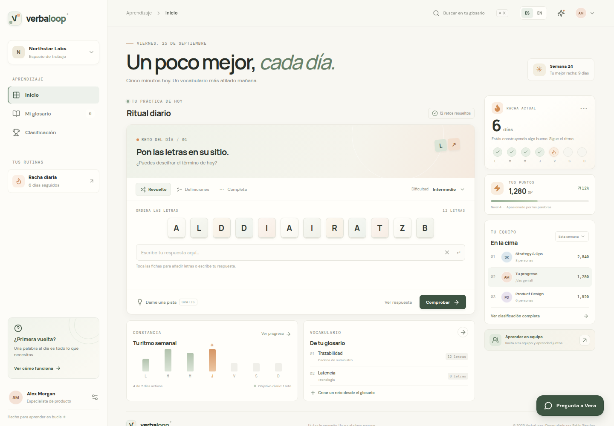
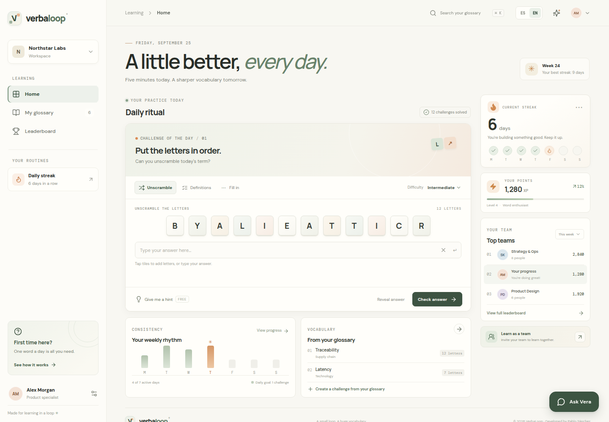
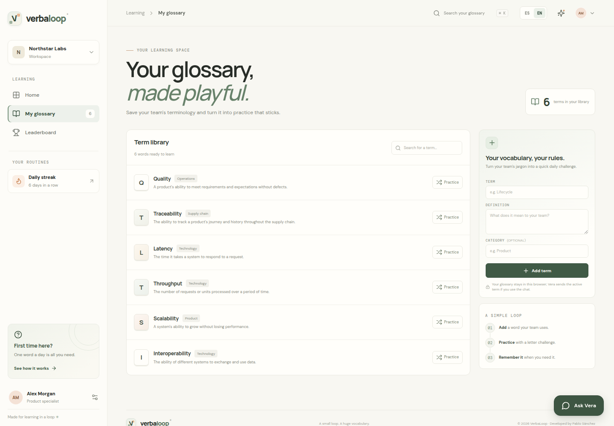
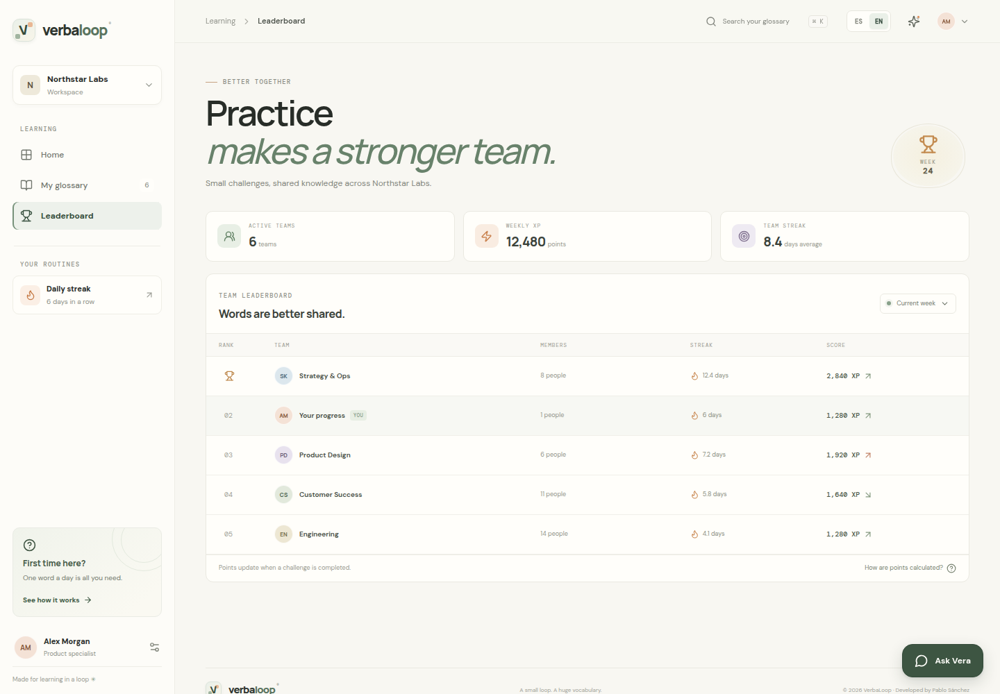

# VerbaLoop

A little better, every day. / Un poco mejor, cada día.

## English

### What is VerbaLoop?

VerbaLoop is a lightweight, gamified practice space that helps teams get comfortable with industrial terminology and product vocabulary through short daily challenges.

### What can I do?

- Solve three kinds of daily puzzle: **Unscramble**, **Definitions**, and **Fill in**.
- Choose **Beginner**, **Intermediate**, or **Expert** difficulty.
- Ask Vera for a hint or basic help using VerbaLoop.
- Browse the sample glossary or add your team's terms, definitions, and optional categories.
- Turn a glossary entry into a practice challenge.
- Track sample XP, streaks, weekly activity, and team rankings.
- Switch the interface between English and Spanish with the top-bar language selector. Your choice is remembered in this browser.

### How to use it

1. Pick a puzzle type and difficulty.
2. Solve the daily term, ask for a hint, or reveal the answer.
3. Open **My glossary** to add or practice team vocabulary.
4. Visit **Leaderboard** to explore the sample team progress.
5. Choose **EN** or **ES** at the top to change the interface language.

### Privacy and storage

Glossary entries, language preference, and progress are stored in this browser. Use practice terms that are appropriate to share, and do not enter personal or confidential information when asking Vera for help. Sample teams and rankings are illustrative.

### Run locally

For development, use Node.js 22 and pnpm:

```bash
pnpm install
pnpm dev
pnpm test
pnpm check
pnpm build
```

### Credits

Developed by **Pablo Sánchez**.

---

## Español

### ¿Qué es VerbaLoop?

VerbaLoop es un espacio de práctica ligero y gamificado que ayuda a los equipos a familiarizarse con la terminología industrial y el vocabulario de producto mediante retos diarios breves.

### ¿Qué puedo hacer?

- Resolver tres tipos de acertijo diario: **Revuelto**, **Definiciones** y **Completa**.
- Elegir la dificultad **Principiante**, **Intermedio** o **Experto**.
- Pedirle a Vera una pista o ayuda básica para utilizar VerbaLoop.
- Explorar el glosario de muestra o añadir términos, definiciones y categorías opcionales de tu equipo.
- Convertir cualquier término del glosario en un reto de práctica.
- Consultar XP, rachas, actividad semanal y clasificación de equipos de muestra.
- Cambiar la interfaz entre inglés y español con el selector de idioma de la barra superior. La elección se recuerda en este navegador.

### Cómo usarlo

1. Elige el tipo de acertijo y la dificultad.
2. Resuelve el término diario, pide una pista o revela la respuesta.
3. Abre **Mi glosario** para añadir o practicar vocabulario del equipo.
4. Visita **Clasificación** para explorar el progreso de muestra de los equipos.
5. Elige **EN** o **ES** en la parte superior para cambiar el idioma de la interfaz.

### Privacidad y almacenamiento

El glosario, el idioma elegido y el progreso se guardan en este navegador. Practica con términos apropiados para compartir y no incluyas información personal o confidencial al pedir ayuda a Vera. Los equipos y las clasificaciones de ejemplo son ilustrativos.

### Ejecución local

Para desarrollo, utiliza Node.js 22 y pnpm:

```bash
pnpm install
pnpm dev
pnpm test
pnpm check
pnpm build
```

### Créditos

Desarrollado por **Pablo Sánchez**.

---

## Product screenshots / Capturas del producto

### English — Daily challenge / Inglés — Reto diario



### Español — Reto diario



### English — Team glossary / Inglés — Glosario del equipo



### English — Team leaderboard / Inglés — Clasificación del equipo


